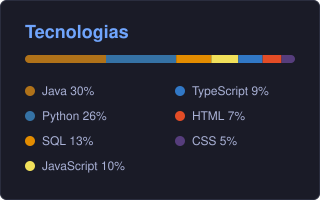

<h1>👨🏾‍💻 Felipe Silva Passos </h1>  

Full Stack Developer · Back-end Lover · Estudante de ADS na FIAP Paulista

</div>

---

##  Quem sou eu

Sou desenvolvedor **Full Stack** com foco em **Back-end**, onde me sinto mais em casa construindo APIs, regras de negócio e trabalhando com bancos de dados. Atualmente curso **Análise e Desenvolvimento de Sistemas** na **FIAP – Paulista** e estou sempre buscando evoluir e aprender coisas novas.

```java
public class Felipe {
    String cargo       = "Desenvolvedor Full Stack";
    String foco        = "Back-end";
    String faculdade   = "ADS - FIAP Paulista";
    String[] favoritas = { "Java", "Python" };
}
```

---

## 🧰 Stack

<div align="center">

**Back-end**


**Front-end**


**Ferramentas**


</div>

---

## 📊 Linguagens

<div align="center">
  
</div>

---

## 🌎 Idiomas

<div align="center">

| 🇧🇷 Português | 🇺🇸 Inglês | 🇪🇸 Espanhol | 🤟 Libras |
|:---:|:---:|:---:|:---:|
| Nativo | Básico | Básico | Básico |

</div>

---

## 📈 GitHub Stats

<div align="center">
  
  
</div>

---

## 🤝 Vamos conversar?

<div align="center">

[](www.linkedin.com/in/felipe-passos-110668397)
[](felipe.silvapassos.ti@gmail.com)

</div>
